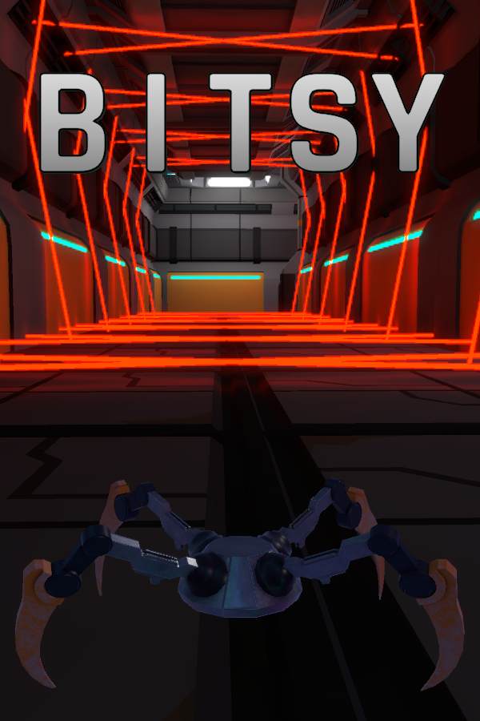
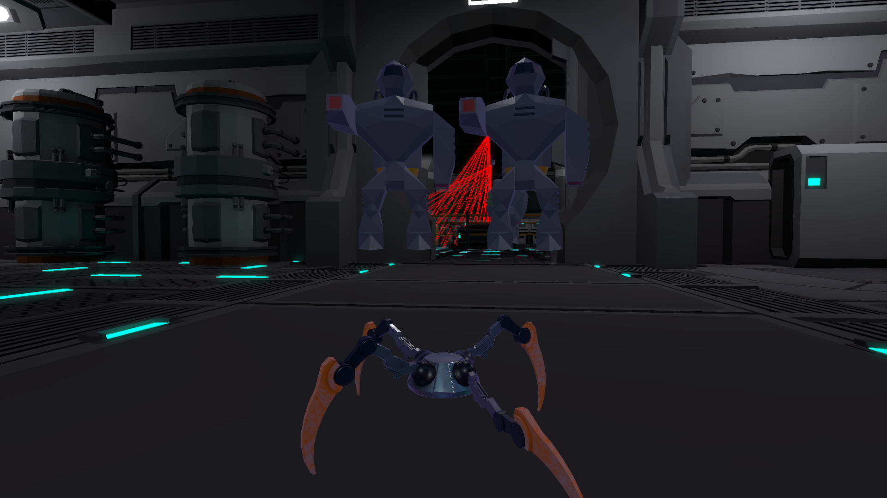
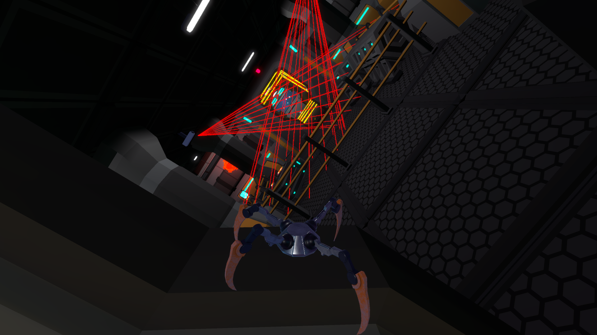

# Bitsy

Bitsy is a stealth puzzle game where you play as a robotic spider to accomplish missions. This game was developed as part of a team during a 10 week internship with Neumont Game Studio. Bitsy was built using Unity Engine.

The spider uses a custom character controller to walk on virtually any surface at any angle. The body is procedurally animated so the legs will always match up with the spider's movement and the shape of what they are walking on. The camera follows at a set distance and doesn't clip through walls.

The player has several abilities such as an EMP grenade, smoke grenade, a knockout dart, and temporary invisibility. They can also pick up a lunge upgrade which allows them to jump, and a web zip ability which shoots a web where the player is looking and pulls them across the gap to their target.

The player can be detected either visually by being inside the cone of vision of a camera or one of the robots, or by tripping the yellow lasers. If they are fully detected then the robots will shoot at the player, and turrets pop out and shoot as well.

This game is on [Steam](https://store.steampowered.com/app/2325070/Bitsy/)!